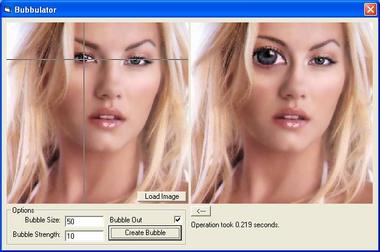



## A Bubble generator\. Screws with peoples faces\. v funny

### Description

Ths puts a bulge behind an image to enlarge features of the image. You can get a photo of someones face and make him look like a tool. Also pinches images. Very affective.
 
### More Info
 

             |
---                |---
**Submitted On**   |2004-10-22 11:49:28
**By**             |[Scott Buckley](https://github.com/Planet-Source-Code/PSCIndex/blob/master/ByAuthor/scott-buckley.md)
**Level**          |Intermediate
**User Rating**    |5.0 (20 globes from 4 users)
**Compatibility**  |VB 6\.0
**Category**       |[Graphics](https://github.com/Planet-Source-Code/PSCIndex/blob/master/ByCategory/graphics__1-46.md)
**World**          |[Visual Basic](https://github.com/Planet-Source-Code/PSCIndex/blob/master/ByWorld/visual-basic.md)
**Archive File**   |[A\_Bubble\_g18126210312004\.zip](https://github.com/Planet-Source-Code/scott-buckley-a-bubble-generator-screws-with-peoples-faces-v-funny__1-57028/archive/master.zip)

### API Declarations

Get/SetDIBits

